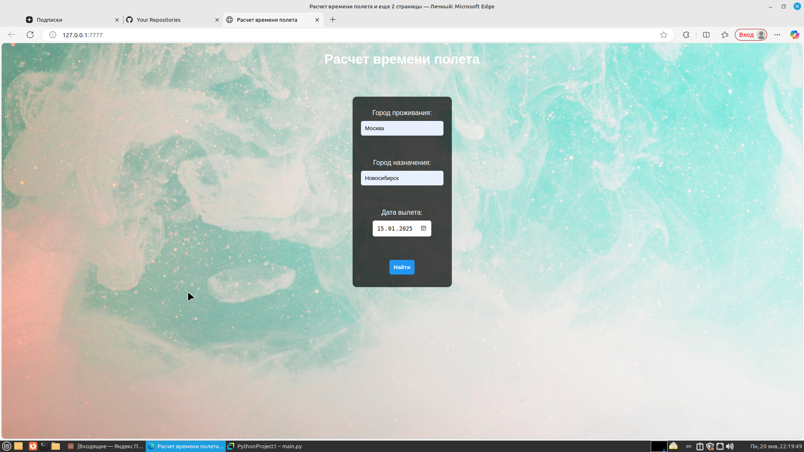
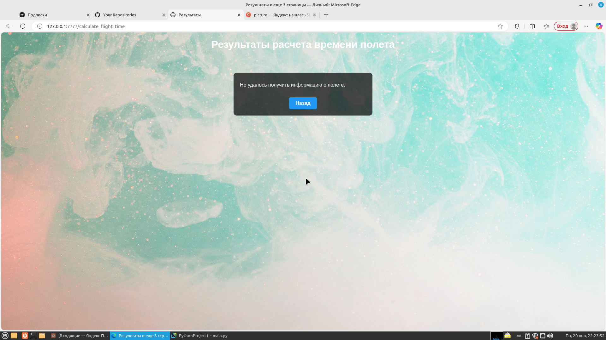
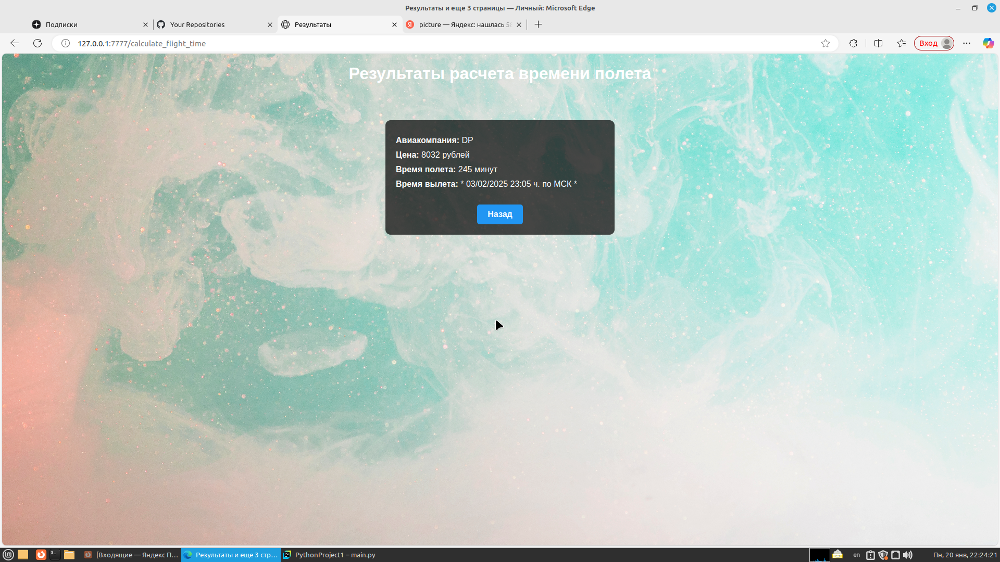

# Aвиаперелёты - Приложение для поиска билетов и расчета времени полета

Это приложение позволяет пользователям находить рейсы между двумя городами на основе введённых названий городов и даты вылета. Используются FastAPI для создания веб-приложения и API TravelPayouts для получения данных о рейсах.

В данный момент развернут на: http://89.104.70.167:8000/ -- сервер удалила.

## Установка

### Необходимые зависимости

Убедитесь, что у вас установлены следующие зависимости перед запуском приложения:

- **Python 3.10+**
- **FastAPI**
- **httpx**
- **uvicorn**

Вы можете установить необходимые библиотеки с помощью `pip`:

```bash
pip install fastapi httpx uvicorn
```

### Получение API ключа

Зарегистрируйтесь на TravelPayouts для получения API ключа, необходимого для работы приложения.


### Конфигурация


1. Создайте файл `config.py` в корне вашего проекта и добавьте в него ваш API ключ:
```python
# config.py
TRAVELPOUT_API_KEY = "YOUR_API_KEY"  # Замените YOUR_API_KEY на ваш API ключ
```

### Установка Docker

Если у вас не установлен Docker, вы можете установить его, следуя [официальной инструкции по установке Docker](https://docs.docker.com/get-docker/).

### Сборка Docker-образа

После установки Docker, клонируйте этот репозиторий и перейдите в директорию проекта:

```bash
git clone https://github.com/VikaMironova/calculate_flight_time.git
cd calculate_flight_time-main
```
Теперь соберите Docker-образ, выполнив следующую команду:

```bash
docker build -t your-image-name .
```

### Запуск Docker-контейнера

После успешной сборки образа запустите контейнер с помощью следующей команды:

```bash
docker run -p 8000:8000 your-image-name
```
### Запуск приложения

Для запуска приложения локально:

```bash
uvicorn main:app --reload
```

Для запуска приложения, если собран Docker-контейнер:

```bash
http://0.0.0.0:8000/
```

### Использование

На главной странице вы сможете ввести город вылета, город назначения и дату вылета. После отправки формы приложение выполнит поиск IATA-кодов для введенных городов и предоставит информацию о доступных рейсах, включая:


- Время полета
- Авиакомпанию
- Стоимость билета
- Время вылета


В дальнейшем сайт будет дополняться.

Примерное отображение сайта:







Развертывание сайта на reg.ru со встроенным Docker:


1. Создайте образ из работающего контейнера: Если у вас есть работающий контейнер, вы можете создать образ из него с помощью команды docker commit. Например:
```bash
docker commit <container_id> my-image
```
Замените <container_id> на ID вашего контейнера.

2. Сохраните образ в файл: Используйте команду docker save, чтобы сохранить образ в файл:
```bash
docker save -o my_image.tar my-image
```
Это создаст файл my_image.tar в текущем каталоге.

3. Скопируйте файл на удаленный сервер: Используйте scp, чтобы скопировать файл на удаленный сервер:
```bash
scp my_image.tar ----@--.--.--.---:/----
```
4. Загрузите образ на удаленном сервере: После того как файл будет скопирован, подключитесь к удаленному серверу:
```bash
ssh ----@--.--.--.---
```
5. Затем загрузите образ в Docker на удаленном сервере:
```bash
docker load -i /----/my_image.tar
```
6. Запустите контейнер из загруженного образа: Теперь вы можете запустить контейнер из загруженного образа:
```bash
docker run -it my-image
```
